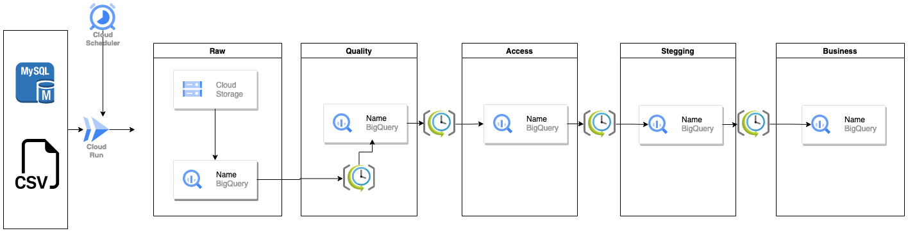
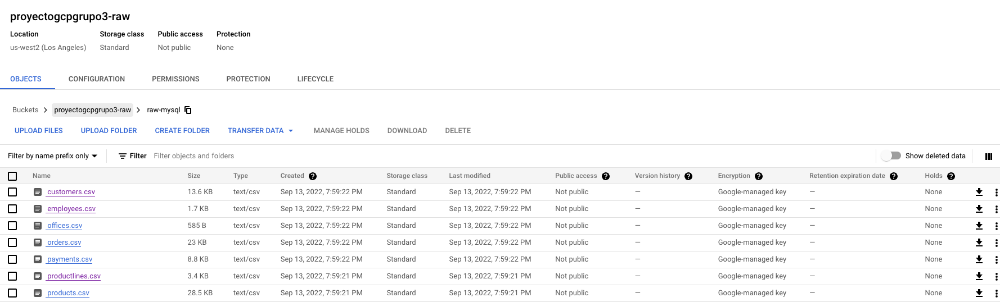
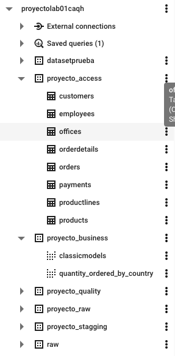

# Diagrama de arquitectura

### Principales componentes
1. MySql
2. Cloud Scheduler
3. Cloud Run Jobs
4. Cloud Storage
5. Bigquery scheduled queries
6. Bigquery tablas externas y tablas nativas.

### Despliegue de cloud run
Se ejecutaron los siguientes pasos.
1. Ubicarse en la carpeta scripts
2. Si se desea ejecutar localmente 
   1. sudo chmod +x main.py
   2. Opcional instalar virtualenv
   3. pip3 install -r requirements.txt
   4. No olvidar modificar las credencials o el key file dentro de main.py.
   5. Luego ejecutar `python3 main.py` o `./main.py`
3. Si se desea ejecutar con docker
   1. `docker build -t load-mysql-to-gcs .`
   2. `docker run --name load load-mysql-to-gcs`
4. Una vez funcionando el container, desplegarlo a GCR.
   1. `gcloud auth application-default login`
   2. `gcloud config configurations list`
   3. `gcloud config set project your_project_id`
   4. `gcloud auth configure-docker`
   5. `docker tag load-mysql-to-gcs gcr.io/your_project_id/load-mysql-to-gcs`
   6. `docker push gcr.io/your_project_id/load-mysql-to-gcs`

### Crear cloud run job

1. Verificar el job creado
   1. `gcloud beta run jobs list`

### Ejecutar el job

1. `gcloud beta run jobs describe load-mysql-to-gcs --region us-central1`

### Verificar los archivos subidos en GCS

### Datasets creados por entorno

### Scheduled queries

### Dashboard en Google Data Studio

### Scheduled queries
1. Están ubicados en la carpeta `queries`

